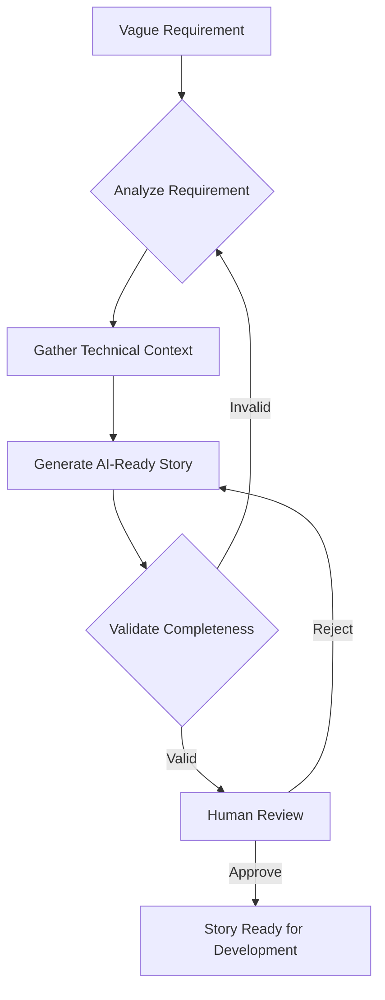
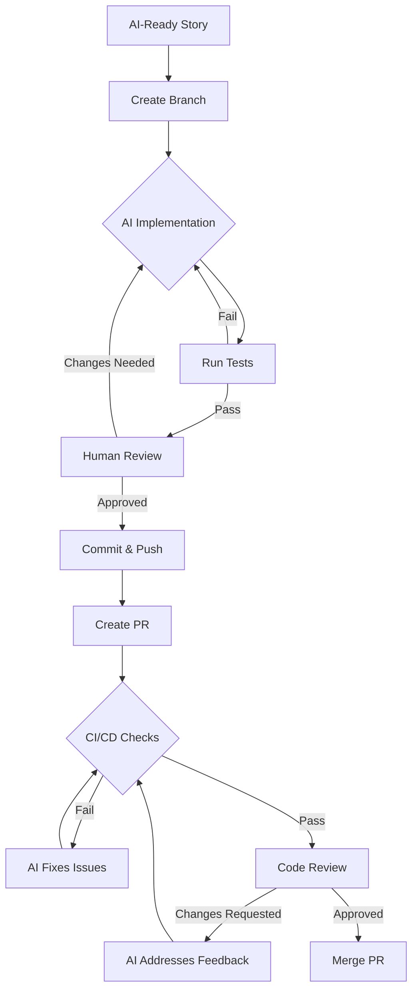

# Workflow Diagrams

## Overview
This document illustrates the workflows for different personas using the AI Workflow Orchestration Tool.

## Tech Lead Workflow

### High-Level Flow


### Detailed Tech Lead Process
```
┌─────────────────────────────────────────────────────────────┐
│                     TECH LEAD WORKFLOW                       │
├─────────────────────────────────────────────────────────────┤
│                                                              │
│  1. INPUT ANALYSIS                                           │
│  ┌─────────────┐    ┌──────────────┐    ┌──────────────┐  │
│  │   GitHub    │    │    Slack     │    │    Email     │  │
│  │   Issue     ├───►│   Message    ├───►│   Request    │  │
│  └─────────────┘    └──────────────┘    └──────────────┘  │
│          │                  │                    │           │
│          └──────────────────┴────────────────────┘           │
│                             ▼                                │
│  2. REQUIREMENT ANALYSIS    AI                               │
│  ┌────────────────────────────────────────────────────┐    │
│  │  • Extract core functionality                       │    │
│  │  • Identify ambiguities                            │    │
│  │  • Generate clarifying questions                   │    │
│  │  • Check completeness                              │    │
│  └────────────────────────────────────────────────────┘    │
│                             ▼                                │
│  3. TECHNICAL CONTEXT       AI + Codebase                   │
│  ┌────────────────────────────────────────────────────┐    │
│  │  • Scan related files                              │    │
│  │  • Identify patterns to follow                     │    │
│  │  • Find integration points                         │    │
│  │  • List dependencies                               │    │
│  └────────────────────────────────────────────────────┘    │
│                             ▼                                │
│  4. STORY GENERATION        AI                               │
│  ┌────────────────────────────────────────────────────┐    │
│  │  • Define boundaries (allowed/forbidden files)      │    │
│  │  • Create acceptance criteria                      │    │
│  │  • Generate test cases                             │    │
│  │  • Add validation commands                         │    │
│  └────────────────────────────────────────────────────┘    │
│                             ▼                                │
│  5. HUMAN REVIEW            Tech Lead                       │
│  ┌────────────────────────────────────────────────────┐    │
│  │  • Verify technical accuracy                       │    │
│  │  • Confirm scope is appropriate                    │    │
│  │  • Approve or request changes                      │    │
│  └────────────────────────────────────────────────────┘    │
│                             ▼                                │
│  6. OUTPUT                  AI-Ready Story                  │
│  ┌────────────────────────────────────────────────────┐    │
│  │  STORY-456: Add User Authentication                │    │
│  │  ├─ Allowed files: [auth/*, user/*, tests/*]      │    │
│  │  ├─ Forbidden: [payment/*, admin/*]               │    │
│  │  ├─ Test cases: 5 scenarios                       │    │
│  │  └─ Validation: npm test, npm lint                │    │
│  └────────────────────────────────────────────────────┘    │
│                                                              │
└─────────────────────────────────────────────────────────────┘
```

## Developer Workflow

### High-Level Flow


### Detailed Developer Process
```
┌─────────────────────────────────────────────────────────────┐
│                    DEVELOPER WORKFLOW                         │
├─────────────────────────────────────────────────────────────┤
│                                                              │
│  1. INITIALIZATION                                           │
│  ┌──────────────┐         ┌────────────────────────────┐   │
│  │ Fetch Story  │────────►│ STORY-456: Authentication │   │
│  │ from GitHub  │         │ • Allowed files listed     │   │
│  └──────────────┘         │ • Test cases defined       │   │
│         │                  │ • Success criteria clear   │   │
│         │                  └────────────────────────────┘   │
│         ▼                                                    │
│  ┌──────────────┐                                          │
│  │Create Branch │         git checkout -b feature/456      │
│  └──────────────┘                                          │
│         │                                                    │
│         ▼                                                    │
│  2. IMPLEMENTATION          AI (Claude)                      │
│  ┌────────────────────────────────────────────────────┐    │
│  │  FOR each subtask in story:                        │    │
│  │    • Read allowed files only                       │    │
│  │    • Implement within boundaries                   │    │
│  │    • Follow specified patterns                     │    │
│  │    • Write tests                                   │    │
│  └────────────────────────────────────────────────────┘    │
│         │                                                    │
│         ▼                                                    │
│  3. VALIDATION              Automated                        │
│  ┌────────────────┐    ┌─────────────┐    ┌───────────┐   │
│  │   Run Tests    │───►│  Run Lint   │───►│Type Check │   │
│  └────────────────┘    └─────────────┘    └───────────┘   │
│         │                     │                   │          │
│         └─────────────────────┴───────────────────┘          │
│                              ▼                               │
│                     ┌─────────────────┐                     │
│                     │  All Passing?   │                     │
│                     └────────┬────────┘                     │
│                          No  │  Yes                         │
│                          ▼   │   ▼                          │
│                    ┌─────────┴────────────┐                │
│                    │  AI Fixes Issues     │                │
│                    └──────────────────────┘                │
│                                                              │
│  4. HUMAN CHECKPOINT        Developer                       │
│  ┌────────────────────────────────────────────────────┐    │
│  │  • Review implementation                           │    │
│  │  • Verify requirements met                         │    │
│  │  • Approve or request changes                     │    │
│  └────────────────────────────────────────────────────┘    │
│         │                                                    │
│         ▼                                                    │
│  5. GIT OPERATIONS          Automated                       │
│  ┌──────────────┐    ┌──────────────┐    ┌────────────┐   │
│  │    Commit    │───►│     Push     │───►│ Create PR  │   │
│  └──────────────┘    └──────────────┘    └────────────┘   │
│         │                                                    │
│         ▼                                                    │
│  6. CI/CD LOOP              Automated + AI                  │
│  ┌────────────────────────────────────────────────────┐    │
│  │  WHILE checks failing:                             │    │
│  │    • AI analyzes failures                          │    │
│  │    • AI implements fixes                           │    │
│  │    • Commit and push                               │    │
│  │    • Re-run checks                                 │    │
│  └────────────────────────────────────────────────────┘    │
│         │                                                    │
│         ▼                                                    │
│  7. PR REVIEW               Human + AI                      │
│  ┌────────────────────────────────────────────────────┐    │
│  │  • Human reviews code                              │    │
│  │  • Requests changes                                │    │
│  │  • AI addresses feedback                           │    │
│  │  • Iterate until approved                          │    │
│  └────────────────────────────────────────────────────┘    │
│         │                                                    │
│         ▼                                                    │
│  8. COMPLETION              Automated                       │
│  ┌──────────────┐                                          │
│  │  Merge PR    │         ✓ Story Complete                 │
│  └──────────────┘                                          │
│                                                              │
└─────────────────────────────────────────────────────────────┘
```

## Interaction Between Workflows

```
┌─────────────────┐                    ┌─────────────────┐
│   PRODUCT       │                    │   TECH LEAD     │
│   REQUIREMENT   │                    │   WORKFLOW      │
└────────┬────────┘                    └────────┬────────┘
         │                                      │
         │  Vague requirement                   │
         └─────────────────────────────────────►│
                                               │
                                               │ Analyze
                                               │ Generate Story
                                               │ Validate
                                               │
                                               ▼
                                    ┌──────────────────┐
                                    │   AI-READY       │
                                    │     STORY        │
                                    └────────┬─────────┘
                                            │
         ┌──────────────────────────────────┘
         │
         ▼
┌─────────────────┐                    ┌─────────────────┐
│   DEVELOPER     │                    │    MERGED       │
│   WORKFLOW      │                    │      CODE       │
└────────┬────────┘                    └────────▲────────┘
         │                                      │
         │ Implement                            │
         │ Test                                 │
         │ Review                               │
         │ Fix CI                               │
         └──────────────────────────────────────┘
```

## State Transitions

### Tech Lead Workflow States
```
[INIT] ──► [ANALYZING] ──► [GATHERING_CONTEXT] ──► [GENERATING_STORY]
                │                │                        │
                ▼                ▼                        ▼
             [ERROR]         [ERROR]                  [ERROR]
                                                         │
                                                         ▼
[COMPLETE] ◄── [REVIEW] ◄── [VALIDATING] ◄─────────────┘
     ▲            │              │
     └────────────┘              ▼
                             [ERROR]
```

### Developer Workflow States
```
[INIT] ──► [FETCHING_STORY] ──► [CREATING_BRANCH] ──► [IMPLEMENTING]
                │                      │                     │
                ▼                      ▼                     ▼
             [ERROR]               [ERROR]               [TESTING]
                                                            │
                                                            ▼
[COMPLETE] ◄── [MERGING] ◄── [ADDRESSING_REVIEW] ◄── [HUMAN_REVIEW]
                   ▲                │                       │
                   │                ▼                       ▼
            [FIXING_CI] ◄── [CREATING_PR] ◄── [COMMITTING]
```

## Error Handling Flow

```
┌─────────────────┐
│  Error Occurs   │
└────────┬────────┘
         │
         ▼
┌─────────────────┐     Yes    ┌─────────────────┐
│  Recoverable?   ├────────────►│   Retry with    │
└────────┬────────┘             │   Backoff       │
         │                      └─────────────────┘
         │ No
         ▼
┌─────────────────┐     Yes    ┌─────────────────┐
│ Partial Success?├────────────►│  Save State &   │
└────────┬────────┘             │  Allow Resume   │
         │                      └─────────────────┘
         │ No
         ▼
┌─────────────────┐
│   Rollback &    │
│   Notify User   │
└─────────────────┘
```

---

*These diagrams illustrate the complete flow for both Tech Lead and Developer personas, showing how AI assistance is bounded and controlled throughout the process.*